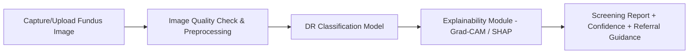

# THANURAKSHA 👁️
### Explainable AI-Based Diabetic Retinopathy Screening for Rural India

> A screening-support prototype that predicts diabetic retinopathy (DR) from retinal fundus images and explains *why* — using Explainable AI (XAI) — to support (not replace) clinical referral decisions.

---

## 📌 Overview

THANURAKSHA is a final-year engineering project focused on building a deep-learning pipeline that:

1. Accepts a retinal fundus image
2. Checks image quality and preprocesses it
3. Predicts the presence/severity of diabetic retinopathy
4. Generates a visual explanation (e.g., Grad-CAM/SHAP) highlighting the regions driving the prediction
5. Produces a concise, screening-oriented report with referral guidance

**Core idea:**
```
Retinal Fundus Image → Preprocessing → DR Prediction → Explainable Heatmap/Attribution → Screening Report + Referral Guidance
```

⚠️ **Disclaimer:** This system is designed for screening support only. It is **not** a diagnostic tool and does not replace evaluation by a qualified ophthalmologist.

---

## 🧑‍🤝‍🧑 Team

| # | Reg. No. | Name |
|---|----------|------|
| 1 | 9824005008 | Saladi Harshith |
| 2 | 9923005034 | Nagireddy Gari Vara Prasad |
| 3 | 9923005317 | Gillela Hemanth Reddy |

**Guide:** Dr. M. Pallikonda Rajasekaran

**Department:** Electronics and Communication Engineering
**Institution:** Kalasalingam Academy of Research and Education, Krishnankoil – 626126

---

## 🎯 Motivation & Need

- DR is a leading cause of vision impairment among people with diabetes and often develops with few early symptoms — regular screening matters.
- Global diabetes prevalence is rising sharply, with the majority of affected adults living in low- and middle-income countries.
- Indian and Tamil Nadu-specific studies show meaningful (and variable, urban-vs-rural) DR prevalence, underscoring the need for accessible, scalable screening tools — especially in rural settings with limited specialist access.

## ❗ Problem Statement

Build a system that can:
- Screen fundus images for DR
- Reveal the important image regions used for the prediction (interpretability)
- Support (not replace) a qualified eye specialist's final decision
- Work within the practical constraints of rural screening (limited connectivity, specialist availability, privacy)

---

## 🔍 Research Basis

The project is grounded in a 10-paper literature review spanning:
- Deep learning for DR classification (CNNs, transfer learning)
- Lesion localization and grading
- Explainable AI methods: **Grad-CAM, Grad-CAM++, Score-CAM, SHAP**
- Privacy-preserving / federated learning approaches
- Vision Transformer-based multi-trait fundus analysis

**Identified research gaps:**
- High benchmark accuracy doesn't guarantee generalization across populations/cameras/clinics
- Explanation *quality* (clinical relevance of XAI output) is often under-evaluated
- Most studies are dataset-centric rather than workflow-centric for real rural screening

---

## 🏗️ Proposed System Architecture



### Functional Requirements
- Accept supported retinal fundus images
- Validate basic image suitability
- Preprocess consistently with model training pipeline
- Predict DR category with confidence/probability
- Generate and display XAI visualization
- Produce a concise, versioned screening report

### Non-Functional Requirements
Usability · Interpretability · Performance · Privacy · Reliability · Maintainability · Scalability

---

## 🧠 Model & XAI Candidates

| Component | Candidates | Purpose |
|---|---|---|
| Baseline CNN | ResNet / DenseNet / EfficientNet | DR feature learning |
| Lightweight model | MobileNet | Resource-constrained inference |
| XAI (visual) | Grad-CAM / Grad-CAM++ / Score-CAM | Highlight influential regions |
| XAI (attribution) | SHAP | Pixel/feature-level contribution |
| Future extension | Federated Learning | Privacy-preserving multi-site training |

### Evaluation Metrics
Accuracy · Precision · Recall (Sensitivity) · Specificity · F1-score · ROC-AUC · Quadratic Weighted Kappa · Confusion Matrix · XAI lesion-overlap consistency

---

## 📊 Candidate Datasets

| Dataset | Use Case | Notes |
|---|---|---|
| APTOS 2019 | DR grading | Widely used; class imbalance |
| EyePACS | Large-scale DR classification | Large collection; quality varies |
| IDRiD | DR grading + lesion annotation | Smaller, specialized |
| DDR | DR grading / lesion detection | Requires careful split handling |

*Patient-level data leakage is avoided wherever metadata permits; external validation is prioritized before any clinical claims.*

---

## ⚙️ Feasibility Summary

| Type | Summary |
|---|---|
| Technical | Development on Windows 11, Intel i5-12500H, ~16GB RAM; Python/VS Code/Git — GPU to be verified for large-scale training |
| Operational | Upload → screening → explanation integrable into a single workflow prototype |
| Economic | Open-source tools + public datasets keep prototype cost low |
| Research | Strong literature support; gaps remain in generalization & deployment |

---

## ⚠️ Risks & Mitigation

| Risk | Mitigation |
|---|---|
| Class imbalance | Weighted loss, augmentation, class-wise metrics |
| Poor image quality | Automated quality screening + recapture workflow |
| Dataset bias | Cross-dataset testing, careful splits |
| Misleading XAI output | Validate against annotations; treat XAI as supporting, not sole, evidence |
| Data privacy | Minimize identifiers, secure storage |
| Clinical misuse | Clear UI disclaimers, referral-oriented language only |

---

## 🎯 Expected Outcomes

- Trained baseline DR screening model with documented performance
- Explainability module producing visual evidence for predictions
- End-to-end prototype workflow (upload → result)
- Screening report with prediction, explanation, model version, and referral messaging
- Documented limitations and clear scope boundaries

---

## 📦 Scope

**In scope:** Fundus-image DR screening/classification, XAI visualization, model evaluation, prototype application

**Out of scope (v1):** Autonomous diagnosis, treatment prescription, or replacement of ophthalmologists. Clinical validation and regulatory approval are future work.

---

## 🗺️ Roadmap

- [ ] Dataset collection & preprocessing pipeline
- [ ] Baseline CNN model training
- [ ] XAI module integration (Grad-CAM/SHAP)
- [ ] Model evaluation & metrics reporting
- [ ] Prototype application (upload → report UI)
- [ ] Documentation of limitations & referral guidance

---

## 📚 Key References

1. IAPB, *Diabetic Retinopathy / DR Barometer*, 2024–2026
2. IDF Diabetes Atlas, 11th ed., 2025
3. Vashist et al., *Prevalence of diabetic retinopathy in India: National Survey 2015–19*, Indian J. Ophthalmology, 2021
4. Tsiknakis et al., *Deep learning for DR detection and classification: A review*, Computers in Biology and Medicine, 2021
5. Quellec et al., *ExplAIn: Explanatory AI for diabetic retinopathy diagnosis*, Medical Image Analysis, 2021
6. Herrero-Tudela et al., *An explainable deep-learning model reveals clinical clues in DR through SHAP*, Biomedical Signal Processing and Control, 2025

*(Full 16-reference list available in the project analysis report.)*

---

## 🏫 Institution

Department of Electronics and Communication Engineering
Kalasalingam Academy of Research and Education, Krishnankoil – 626126
September 2026

